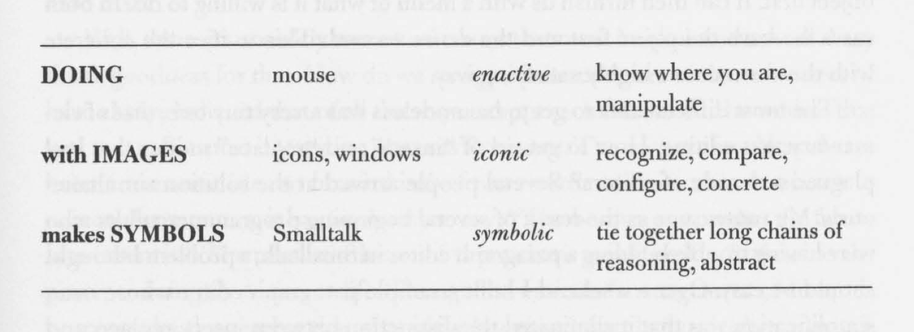

Excerpts from [_User Interface: A Personal View_](https://tinlizzie.org/VPRIPapers/hc_user_interface.pdf) by [Alan Kay](https://en.wikipedia.org/wiki/Alan_Kay)

> "It is easy to see that one of the main reasons that the figurative system is so creative is that it tends not to get blocked because of the constant flitting and darting. The chance of finding an interesting pattern is very high. It is not surprising, either, that many people who are 'figurative' have extreme difficulty getting anything finished-there is always something new and interesting that pops up to distract. Conversely, the 'symbolic' person is good at getting things done, because of the long focus on single contexts, but has a hard time being creative, or even being a good problem solver, because of the extreme tendency to get blocked. In other words, because none of the mentalities is supremely useful to the exclusion of the others, the best strategy would be to try to gently force synergy between them in the user interface design."

> "The slogan also implies—as did Bruner—that one should start with—be grounded in—the concrete 'Doing with Images,' and be carried into the more abstract 'makes Symbols.'"

> "The flitting-about nature of the iconic mentality suggested that having as many resources showing on the screen as possible would be a good way to encourage creativity and problem solving and prevent blockage."
